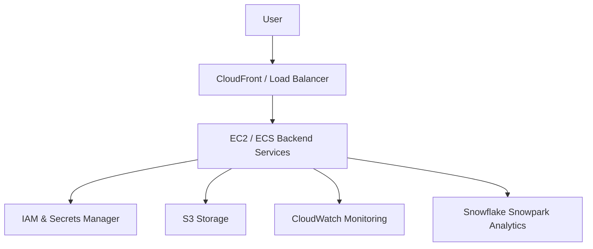

# System Architecture Overview

This document explains how the Remote Staffing System works on AWS.

## Architecture Diagram



## Explanation (Client Friendly)

* Users access the system through a secure web interface.
* Traffic is managed by AWS to ensure fast and reliable performance.
* Backend services process job postings, applications, and analytics.
* Security services protect credentials and access.
* Storage holds files, logs, and reports.
* Monitoring ensures system health.
* Analytics provides insights and reporting.


This document explains in detail the AWS cloud architecture designed and implemented for the **Remote Job Portal**. The architecture focuses on security, scalability, reliability, and analytics readiness. Each AWS service was selected based on its role in supporting a production-grade web application and was configured following best practices.

---

## Overall Architecture Design

The system follows a **layered cloud architecture**, where each layer performs a specific function. This approach simplifies management, improves security, and allows independent scaling of components.

### High-Level Flow
User  
→ Web Access Layer  
→ Compute Layer  
→ Security & Storage Layer  
→ Monitoring & Analytics Layer  

---

## Web Access Layer (User Entry Point)

### What is Used
- AWS-managed web access services such as **CloudFront or Application Load Balancer**

### How It Is Created
1. A load balancer is created in AWS to accept incoming HTTP/HTTPS requests.
2. Listener rules are configured to forward traffic to backend services.
3. Security groups restrict access to only required ports (80/443).

### Access Point
- The **public DNS name of the load balancer** acts as the main access point for users.

### Advantages
- Distributes traffic evenly across backend services
- Improves application availability
- Protects backend servers from direct exposure

---

## Compute Layer (EC2 and ECS)

### What is Used
- **Amazon EC2** for compute infrastructure
- **Amazon ECS** for containerized backend services

### How It Is Created
1. EC2 instances are launched using Amazon Linux.
2. ECS cluster is created on top of EC2 or using Fargate.
3. Backend application is containerized using Docker.
4. ECS task definitions define CPU, memory, ports, and logging.
5. ECS services ensure the desired number of running tasks.

### Access Point
- Backend services are accessed internally through the load balancer.
- No direct public access to EC2 or containers.

### Advantages
- Automatic scaling and self-healing
- Consistent deployment across environments
- Reduced manual server management

---

## Security Layer (IAM and Secrets Manager)

### What is Used
- **AWS IAM** for access control
- **AWS Secrets Manager** for sensitive data

### How It Is Created
1. IAM roles are created for backend services and deployment pipelines.
2. Policies are attached following the least-privilege principle.
3. Secrets (API keys, database credentials) are stored in Secrets Manager.
4. ECS tasks are granted permission to read required secrets.

### Access Point
- Access is role-based, not user-based.
- Secrets are accessed programmatically by authorized services only.

### Advantages
- No hard-coded credentials
- Strong access isolation
- Easy auditing and governance

---

## Storage Layer (Amazon S3)

### What is Used
- **Amazon S3** for storing assets, logs, and configuration files

### How It Is Created
1. S3 buckets are created with meaningful naming conventions.
2. Bucket policies restrict unauthorized access.
3. Encryption and versioning are enabled.
4. Lifecycle rules manage old data.

### Access Point
- Private access via IAM roles
- Public access disabled unless explicitly required

### Advantages
- Highly durable and scalable storage
- Cost-efficient
- Secure by default

---

## Monitoring Layer (CloudWatch)

### What is Used
- **Amazon CloudWatch** for metrics, logs, and alerts

### How It Is Created
1. CloudWatch log groups are created for ECS services.
2. Metrics such as CPU, memory, and error rates are tracked.
3. Alarms notify administrators when thresholds are crossed.

### Access Point
- CloudWatch console and dashboards

### Advantages
- Real-time visibility into system health
- Faster issue detection
- Improved reliability

---

## Analytics Layer (Snowflake Snowpark)

### What is Used
- **Snowflake Snowpark** for analytics and reporting

### How It Is Created
1. Data is securely staged from AWS (via S3).
2. IAM-based authentication is configured.
3. Snowpark processes data for analytics and ML tasks.

### Access Point
- Snowflake console and analytics tools

### Advantages
- Scalable analytics without impacting application performance
- Secure data processing
- Supports advanced insights and future ML use cases

---

## Conclusion

This architecture ensures a **secure, scalable, and maintainable cloud foundation** for the Remote Job Portal. It demonstrates practical implementation of AWS services, clear access control, efficient data handling, and analytics integration, making it suitable for both academic evaluation and real-world deployment.


GitHub will render this automatically.

---

# 🟢 4️⃣ REAL AWS CODE FILES (PROOF OF WORK)

These make your repo look **REAL**.

---

## 🔐 IAM POLICY

📄 `cloud/iam/iam-policies.json`

```json
{
  "Version": "2012-10-17",
  "Statement": [
    {
      "Effect": "Allow",
      "Action": ["s3:GetObject", "s3:PutObject"],
      "Resource": "arn:aws:s3:::remote-job-portal-*/*"
    },
    {
      "Effect": "Allow",
      "Action": ["logs:PutLogEvents"],
      "Resource": "*"
    }
  ]
}


