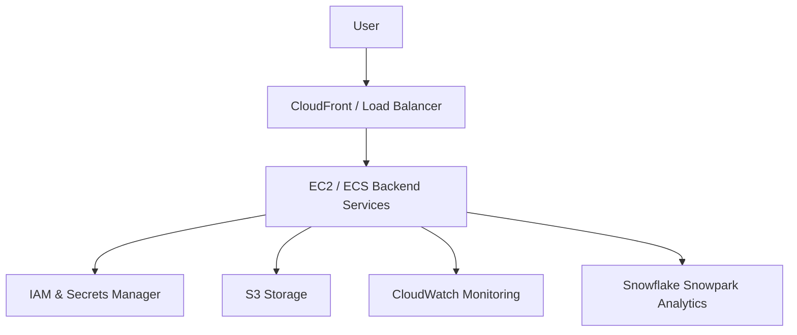

# System Architecture Overview

This document explains how the Remote Staffing System works on AWS.

## Architecture Diagram

## Explanation (Client Friendly)

* Users access the system through a secure web interface.
* Traffic is managed by AWS to ensure fast and reliable performance.
* Backend services process job postings, applications, and analytics.
* Security services protect credentials and access.
* Storage holds files, logs, and reports.
* Monitoring ensures system health.
* Analytics provides insights and reporting.

GitHub will render the Mermaid diagram above automatically in the repository.
