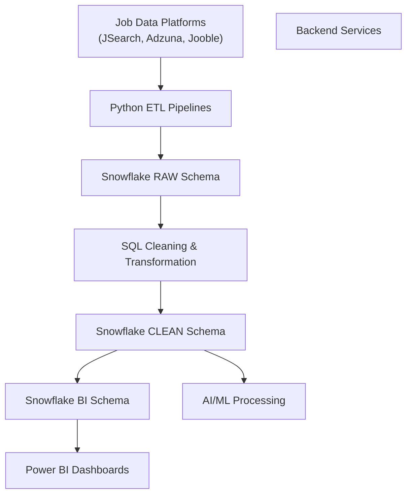

# Data Engineering Architecture – Remote Staffing System

## Overview
This document explains the data engineering architecture implemented for the Remote Staffing System.  
The Data Engineering layer is responsible for collecting job data from multiple platforms, processing and cleaning the data, storing it securely in Snowflake, and preparing analytics-ready datasets for AI processing and Power BI dashboards.

The architecture is designed to be automated, scalable, secure, and suitable for real-time analytics and downstream consumption.

---

## Architecture Flow

## Overview
This document describes the data engineering architecture implemented for the Remote Staffing System.  
The Data Engineering layer is responsible for collecting job data from multiple external platforms, processing and cleaning the data, storing it securely in Snowflake, and preparing analytics-ready datasets for AI processing and Power BI dashboards.

The architecture is designed to be automated, scalable, secure, and reliable, supporting real-time data updates and seamless integration with downstream systems.

---

## Data Flow Summary
The overall data flow follows a structured and layered approach:

- Job data is collected from external job platforms using APIs  
- Python-based ETL pipelines ingest and validate the data  
- Raw data is stored in Snowflake for traceability  
- SQL transformations clean and normalize the data  
- Processed datasets are optimized for analytics  
- Final data is consumed by Power BI, AI models, and backend services  

---

## Job Data Collection
Job data is sourced from multiple job platforms including **JSearch**, **Adzuna**, and **Jooble**.  
These platforms provide job titles, company details, locations, salary ranges, experience requirements, employment types, and skills.

Secure API access is used to fetch this data, ensuring consistent and scalable retrieval of job listings across different sources.

---

## ETL Pipeline Implementation
Python-based ETL pipelines were developed to handle the complete ingestion process.  
These pipelines perform the following tasks:

- API authentication and secure access  
- Pagination handling for large datasets  
- Data validation and error handling  
- Conversion of raw API responses into structured formats  

Automation is achieved using **Windows Task Scheduler**, which runs the ETL pipelines at predefined intervals.  
This ensures that job data is refreshed regularly without any manual intervention.

---

## RAW Data Layer (Snowflake)
The RAW schema in Snowflake stores data exactly as received from external APIs.  
This layer serves multiple purposes:

- Preserves original data for auditing  
- Enables debugging and data traceability  
- Acts as a backup before transformations  

Typical RAW tables include job data collected separately from each platform.

---

## Data Cleaning and Transformation
SQL-based transformations are applied within Snowflake to improve data quality and consistency.  
Key transformation steps include:

- Removing duplicate job listings  
- Normalizing job titles and industries  
- Standardizing salary formats  
- Cleaning and extracting job skills  
- Handling missing or inconsistent values  

These transformations ensure that only clean and reliable data moves forward in the pipeline.

---

## CLEAN Data Layer (Snowflake)
The CLEAN schema contains validated, deduplicated, and standardized datasets.  
This layer acts as the central source of truth for the entire system.

Datasets in this layer are structured to support:
- AI/ML processing
- Backend services
- Analytics and reporting

Example tables include cleaned job data, skill mappings, salary normalization tables, and candidate-related datasets.

---

## BI Layer (Analytics-Ready Data)
The BI schema contains analytics-ready and optimized tables.  
These tables are designed for fast querying and efficient dashboard performance.

Aggregations, KPI metrics, and reporting-friendly structures are created in this layer to support Power BI dashboards.

---

## Data Consumption
The final processed data is consumed by multiple system components:

- **Power BI** uses the BI layer to generate interactive dashboards and KPIs  
- **AI/ML pipelines** use the CLEAN layer for job–candidate matching and embeddings  
- **Backend services** access the CLEAN layer to support application logic and APIs  

This shared data foundation ensures consistency across all system components.

---

## Security and Access Control
Role-based access control is implemented in Snowflake to ensure data security and integrity.

Access is granted based on responsibilities:
- Read-only access for analytics users  
- Controlled access for AI and backend services  
- Administrative access for data management  

This approach prevents unauthorized access while enabling collaboration across teams.

---

## Automation and Reliability
Automation is a key design principle of this architecture.  
Scheduled ETL execution, structured data layers, and controlled access ensure:

- Continuous data availability  
- Minimal manual effort  
- Reliable and repeatable data processing  

---

## Outcome
This data engineering architecture enables:

- Automated multi-source job data ingestion  
- Clean, structured, and standardized datasets  
- Real-time analytics and reporting  
- Reliable support for AI-driven job–candidate matching  
- A scalable and production-ready data pipeline  

The Data Engineering layer forms the backbone of the Remote Staffing System, ensuring accurate data flow and seamless integration across all system components.
    CLEAN --> Backend

